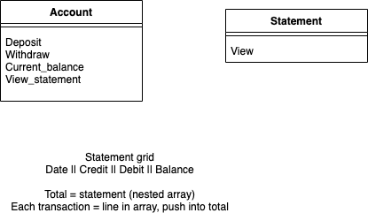
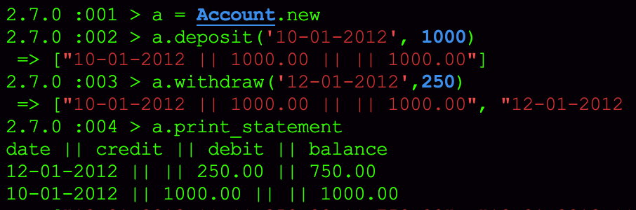

# Bank Tech

User Stories

```
As a user of Evil Bank
So I can look at my account
I would like to be able to open an account

As a user of Evil Bank
So I can save up money
I would like to be able to top up my balance

As a user of Evil Bank
So I can spend my hard earned cash
I would like to be able to make a withdrawal

As a user of Evil Bank
So I can see how poor I really am
I would like to be able to check my balance

As a user of Evil Bank
So I can monitor my financial journey
I would like to be able to see when my account transactions were made

```

## Objective
### Requirements
You should be able to interact with your code via a REPL like IRB or the JavaScript console. (You don't need to implement a command line interface that takes input from STDIN.)
Deposits, withdrawal.
Account statement (date, amount, balance) printing.
Data can be kept in memory (it doesn't need to be stored to a database or anything).

### Acceptance criteria
Given a client makes a deposit of 1000 on 10-01-2012
And a deposit of 2000 on 13-01-2012
And a withdrawal of 500 on 14-01-2012
When she prints her bank statement
Then she would see

```
date || credit || debit || balance
14/01/2012 || || 500.00 || 2500.00
13/01/2012 || 2000.00 || || 3000.00
10/01/2012 || 1000.00 || || 1000.00
```

## Progress

Basic version of bank account created.
Deposit and withdrawal functions can update the balance. User can view their balance at anytime.
Print statement now in separate class with sole responsability.
Dates have been formatted to date, month, year.

## Improvements
- Additional split class for processing
- Mocking, dependency injection

## Installation
- Clone repository
- run ```bundle install```
- run in terminal ```irb -r ./lib/account```
- create an account by ```example = Account.new```
- Deposit money using format date as a string followed by amount as an integer. ```example.deposit('12-01-2020', 100)```
- Withdraw money using format date as a string followed by amount as an integer. ```example.withdraw('13-01-2020', 20)```
- Statement can be viewed by using command ```example.print_statement```


## Testing
- Using Rspec the testing suite
- Simplecov test coverage at 100%

## Collaborators
mattybwoy